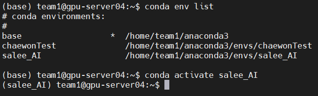
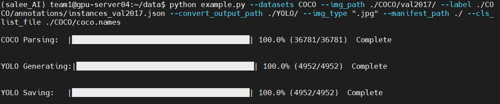

# How to use YOLO & COCO Dataset

> COCO데이터셋과 YOLO 모델로 Object Detection을 구현하는 방법을 설명합니다.

<br/>

### 01. 가상환경 생성

> 라이브러리, 패키지의 충돌을 방지하기 위해 `chaewonTest` 와 `salee_AI` 가상환경을 각각 만들어 사용합니다.



<br/>

### 02. 모델, 데이터셋 다운로드 

> 모델은 YOLO의 Tensorflow인 [`Darkflow`](https://github.com/thtrieu/darkflow) , 데이터셋은 [`COCO Dataset 2017`](https://cocodataset.org/#download) 버전을 사용합니다.

```
파일 구조
-team1
	-darkflow
	-data
		-COCO
			-annotations
				instances_train2017.json
			-val2017
				0000000xxxx.jpg
				...
			coco.names
```

<br/>

### 03. Convert COCO Dataset to YOLO 

> [convert2YOLO](https://github.com/ssaru/convert2Yolo) 로 COCO Dataset을 darkflow프레임워크가 사용하는 label format으로 변경해줍니다.



```
포맷 변경 후 파일 구조
-team1
	-darkflow
	-data
		-COCO
			-annotations
				instances_train2017.json
			-val2017
				0000000xxxx.jpg
				...
			coco.names
		-YOLO
			0000000xxxx.txt
			...
		manifest.txt
```

<br/>