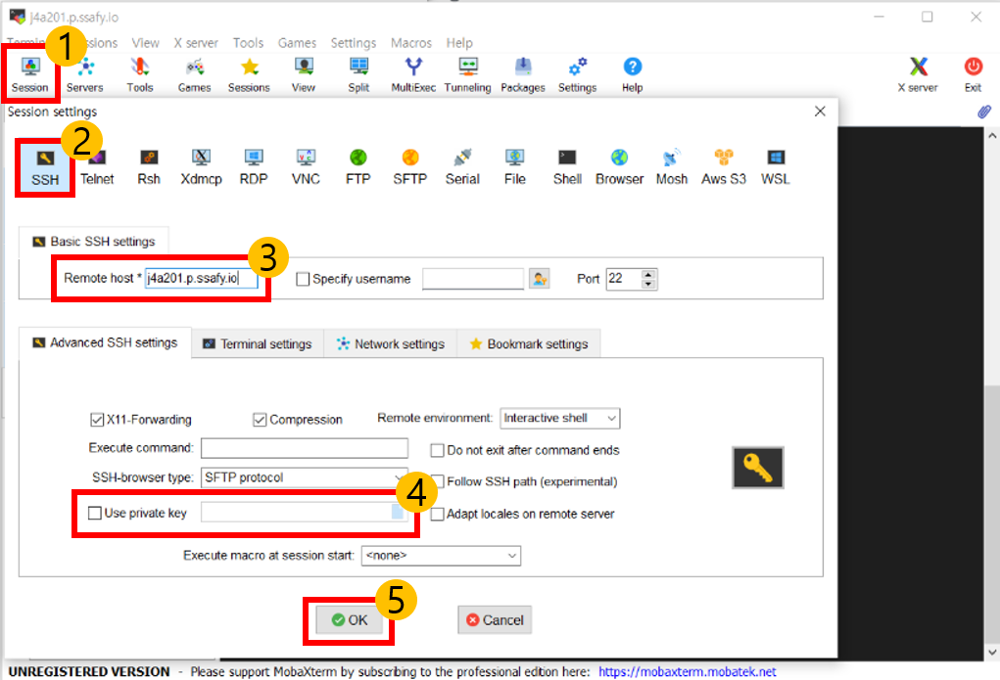

### 1. mobaXterm

> 아래 번호 순서대로 클릭하고 `4` 번에서 `.pem` 키를 등록합니다.



✔ `login as :` 가 뜨면 `ubuntu`를 입력한다.

<br/>

### 2. 기본 세팅 (추가 예정)

```bash
# 설치되어있는 패키지들을 최신버전으로 업그레이드 해줍니다.
$ sudo apt-get update

# 소스코드 빌드 시 필요한 기본적인 패키지를 다운로드합니다.
$ sudo apt-get install build-essential

# vue
# NodeJS를 설치합니다.
$ curl -sL https://deb.nodesource.com/setup_14.x | sudo -E bash -
$ sudo apt-get install nodejs
# npm을 설치합니다.
$ sudo apt-get install npm

# Django
# 파이썬을 설치합니다. (for django)
$ sudo apt-get install python3

# pip를 설치하고 업그레이드합니다.
$ sudo apt-get install python3-pip
$ sudo pip3 install --upgrade pip 
```

<br/>

### 3. Nginx

> Nginx는 클라이언트와 서버 중간에서 대신 통신을 해주는 서버입니다. (리버스 프록시)

```bash
# nginx를 설치합니다.
$ sudo apt-get install nginx

# 현재 사용가능한 서비스별 ufw 설정값을 확인합니다.
$ sudo ufw app list
  Nginx Full # 포트 80(암호화되지 않은 웹 트래픽)과 포트 443(TLS/SSL 암호화 트래픽) 모두 연다.
  Nginx HTTP # 포트 80 (암호화되지 않은 웹 트래픽)을 연다
  Nginx HTTPS # 이 프로필은 포트 443 (TLS/SSL 암호화 트래픽)을 연다.
  OpenSSH 
  
# HTTP를 열어줍니다.
$ sudo ufw allow 'Nginx HTTP'

# sites-available 파일을 수정합니다.
$ sudo vi /etc/nginx/sites-available/default
```

```bash
# /etc/nginx/sites-available/default
server {
        listen 80 default_server;
        listen [::]:80 default_server;

		# front 빌드 후 생긴 dist 파일의 경로를 입력합니다. 
        root /home/ubuntu/Movie_community_Front/dist;
     
        index index.html;

        server_name _;

        location / {
            try_files $uri $uri/ /index.html;
        }
```

```bash
# nginx를 재시작해줍니다.
$ sudo service nginx restart
```

<br/>

