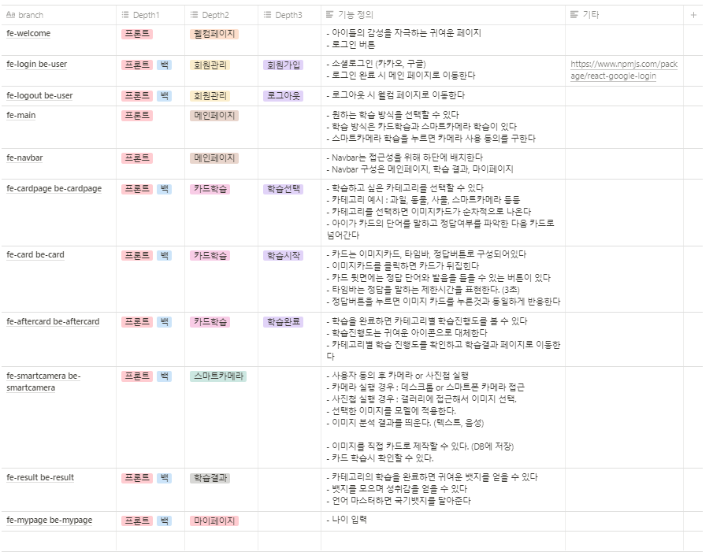

# README

## 프로젝트 명

쏙쏙 (ssok ssok)

## 팀 소개 (Position)

### Back-end

김성진, 이유진

### Font-end

강채원, 이승아, 김효진

### AI

강채원, 이승아

## 프로젝트 소개

## 기술스택

### Back-end

Spring Boot, JPA, MySQL

### Font-end

JavaScript, HTML, CSS, React, Redux, Node.js (Sass)

### AI

Google API, YOLO

## 기능 정의서

 

## 컨벤션

- **[Frontend](https://drive.google.com/file/d/1r4TwL8FZPtXl6Qu_URC9X5fPLwS4ewhY/view?usp=sharing)**
- **[Backend](https://drive.google.com/file/d/1Lu1NI_9eoSqKUJLGmqbckmLPx6H8yEfh/view?usp=sharing)**
- **[Git](https://drive.google.com/file/d/1JF-gLLxCqfaKGRXeTzfED7pqIz8puCCE/view?usp=sharing)**
