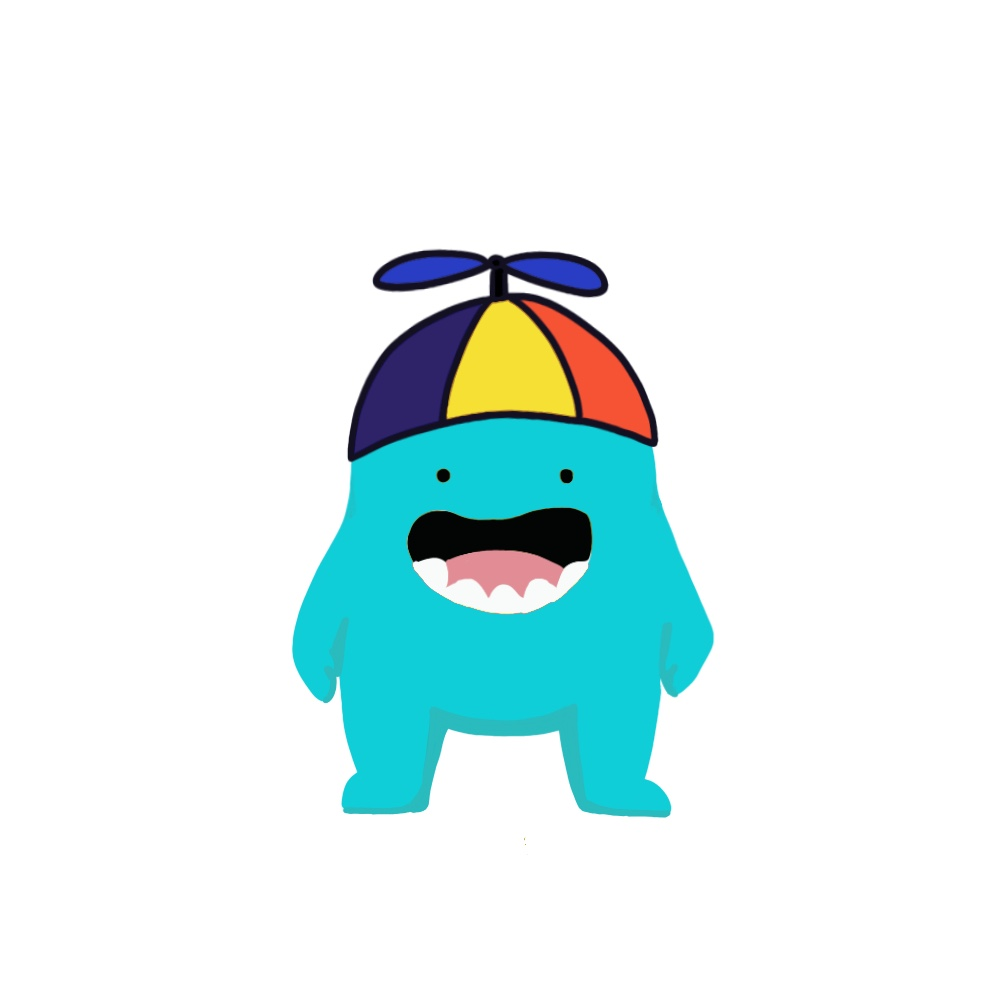
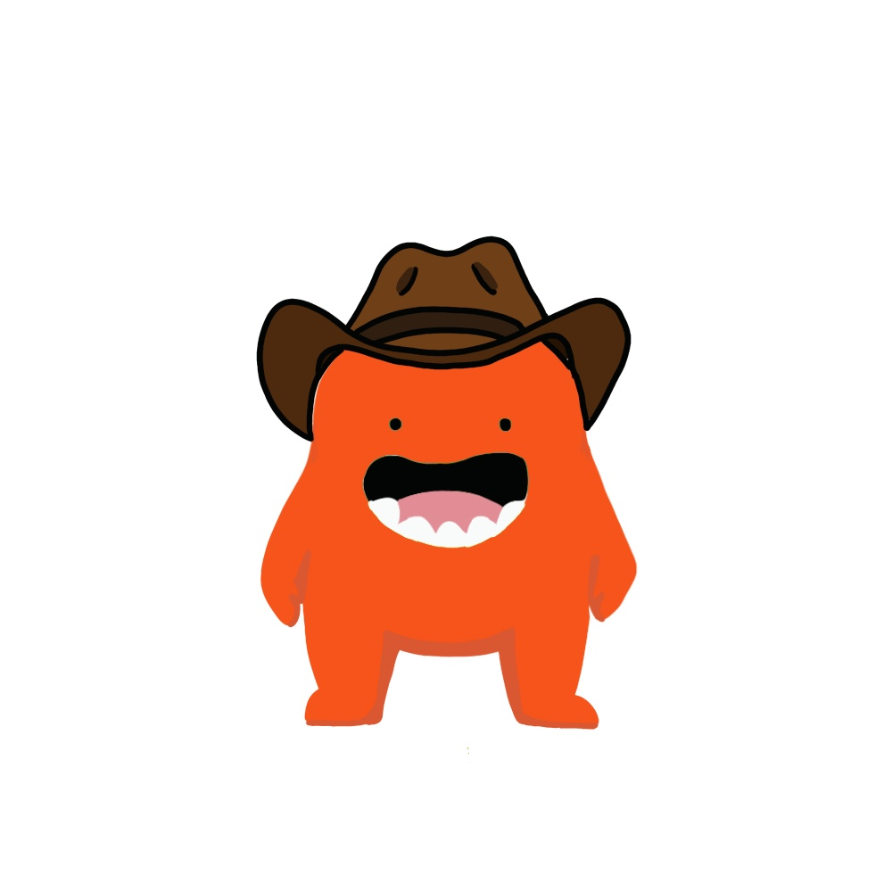
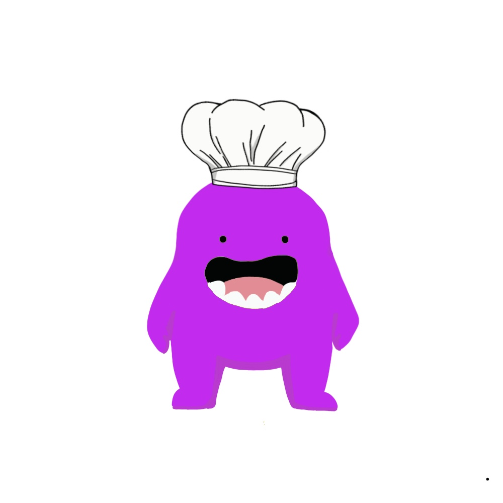

# README

## 프로젝트 명

쏙쏙 (ssok ssok)

 

## 팀 소개 (Position)

### Back-end

김성진, 이유진

### Font-end

강채원, 이승아, 김효진

### AI

강채원, 이승아

 

## 프로젝트 소개

> 언어중추가 가장 활발히 발달하여 모국어 뿐만 아니라 제2외국어 역시 빠르게 습득 가능한 만 6, 7세의 아동들을 대상으로 어휘 게임을 사용하여 다양한 언어를 가르치기 위해 설계된 응용 프로그램입니다. 

- 대상: 유치원, 초등학생
- 목적: 외국어 단어 학습
- 지원 언어: 영어, 중국어, 일본어 ...

 

## 기술 스택

### Back-end

Spring Boot, JPA, MySQL

### Font-end

JavaScript, HTML, CSS, React, Redux, Node.js (Sass)

### AI

Google API, YOLO

 

### 📝 프로젝트 산출물

- **[기능정의서](https://drive.google.com/file/d/11XOk8slJzFT4OeCsT6g3aLQEHd_RBoXg/view?usp=sharing)**

- **컨벤션**
  - **[Frontend](https://drive.google.com/file/d/1r4TwL8FZPtXl6Qu_URC9X5fPLwS4ewhY/view?usp=sharing)**
  - **[Backend](https://drive.google.com/file/d/1Lu1NI_9eoSqKUJLGmqbckmLPx6H8yEfh/view?usp=sharing)**
  - **[Git](https://drive.google.com/file/d/1JF-gLLxCqfaKGRXeTzfED7pqIz8puCCE/view?usp=sharing)**

 

## ERD

 

## 목업

## 캐릭터

> 아이들이 좋아할 수 있는 캐릭터를 직접 제작했습니다.

