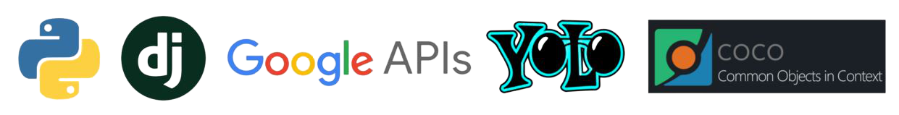

<h2 align="center">쏙쏙 (SSOK SSOK)</h2>

  <p align="center">
    말하고 움직이며 즐겁게 배우는 "AI 외국어 학습 게임"
    <br />
    <br />
    <a href="https://j4a201.p.ssafy.io"><strong>쏙쏙 체험하기</strong></a> |
  	<a href="https://www.youtube.com/watch?v=JT6PqCYbu50"><strong>쏙쏙 UCC</strong></a> | <a href="https://j4a201.p.ssafy.io/card-api/swagger-ui.html"><strong>쏙쏙 Swagger</strong></a> 
</p>

<br />

## 💖 About 쏙쏙

#### 💜 기획의도

​	언어는 일찍 학습할수록 학습효과가 좋습니다. 하지만, 현재 코로나로 인해 아이들의 언어 발달이 늦어지고 있습니다. 아이들은 주로 부모님이나 선생님, 또래의 입모양, 표정 등을 보고 글과 감정을 배웁니다. 마스크로 얼굴을 가린 채 보내는 시간이 계속해서 늘어난다면 언어학습에 제한이 생길 것입니다. 또한, 영어 유치원이나 학원과 같은 딱딱하고 정적인 교육보다 즐겁게 공부하는 분위기가 형성이 되어야 할 것 입니다. 

​	그래서 저희는 `쏙쏙 서비스`를 통해 **아이들이 재미있게 외국어를 학습하는 플랫폼**을 제공하고자 합니다. 귀여운 캐릭터와 애니메이션이 풍부한 화면을 제공하여 **'공부'에 대한 거부감을 최소화**하려합니다. 로그인을 하지 않아도 모든 게임을 즐길 수 있는 **최고의 접근성**과 실시간 음성인식, 이미지 인식을 사용하여 **다양하게 즐길 수 있는 게임**을 제공하고자 합니다.

#### 💙 목표

- **공부 쏙쏙**

  다양한 언어 (한국어, 영어, 일본어, 중국어, 베트남어, 스페인어, 프랑스어) 를 게임을 통해 즐겁게 학습할 수 있습니다. 카드게임에서는 AI가 발음을 듣고 정답여부를 알려주기 때문에 정확한 발음 연습을 할 수 있습니다.

- **재미 쏙쏙**

  귀엽고 아기자기한 애니메이션이 풍부한 화면을 구성합니다. 음성인식과 영상인식을 활용하여 읽기, 말하기, 움직이기 등등 여러 감각을 이용하는 게임을 구현합니다.

#### 💛 프로젝트 소개

쏙쏙은 유치원생, 초등학생을 대상으로하는 어휘 학습 게임입니다. 학생들이 집에서도 편하게, 또 즐겁게 언어를 학습할 수 있게 하자는 취지에서 기획했습니다. 높은 정확도의 실시간 음성 인식을 통해 발음을 연습하고, 단어를 학습할 수 있습니다. 

쏙쏙의 기대효과는 다음과 같습니다. 

- 다양한 언어를 즐겁게 학습한다. 
- 학원을 가지 않아도 정확한 발음을 연습할 수 있다. 
- 흥미를 유발하여 색다른 경험을 할 수 있다.
  
#### 🃏 카드게임


#### 📷 스마트카메라


#### 🔗 구글로그인


<br/>

## :gear: Getting Started

> 쏙쏙 시작 방법입니다. 클라이언트 실행방법을 설명해드립니다. 
>
> AI 서버 동작을 확인하고 싶다면, 4번 이후의 단계를 실행합니다. 

#### Installation

1. Clone the repo

```bash
$ git clone https://lab.ssafy.com/s04-ai-image-sub3/s04p23a201.git
```

2. Install NPM packages

```bash
$ cd frontend
$ yarn install
```

3. run Client

```bash
$ yarn serve
```

4. Install virtual environment & activate

```bash
$ cd AI
$ python -m venv venv
$ source venv/Scripts/activate
```

5. Install requirements.txt

```bash
$ pip install -r requirements.txt
```

6. run AI server

```bash
$ python manage.py runserver
```

<br />

#### Back-End Server 실행 방법
> AUTH 서버와 CARD 서버로 분리됩니다.
> 
> LOCAL과 UBUNTU 에서 접속 방법을 설명해드립니다.

**LOCAL에서 실행**

AUTH SERVER

- 프로젝트 open 후 Build

CARD SERVER

1. C 드라이브 밑에 ssafy 폴더 생성
2. STTService 클래스에서 LOCAL_PATH 설정
3. 구글 STT를 위한 환경변수 등록 (https://codedragon.tistory.com/9406 참고)
4. 실행

**UBUNTU에서 실행**

AUTH SERVER

```bash
$ java -jar spring-social-0.0.1-SNAPSHOT.jar --server.servlet.context-path=/api
```

CARD SERVER

```bash
$ cd s04p23a201/exec/backend
$ export GOOGLE_APPLICATION_CREDENTIALS="/home/ubuntu/s04p23a201/exec/backend/ssokssok-bd6c9dfa56f1.json"
$ java -jar ssokcard-0.0.1-SNAPSHOT.jar --server.servlet.context-path=/card-api --server.port=8081
```

<br />

## 📝 프로젝트 산출물

- **[기능정의서](https://drive.google.com/file/d/11XOk8slJzFT4OeCsT6g3aLQEHd_RBoXg/view?usp=sharing)**
- **[UI / UX 기획안](https://scene.zeplin.io/project/604b1c4af2a74e9762e56a2d)**
- **[System Architecture](https://drive.google.com/file/d/19y2MbwZZ95L9JA6VQIllqFZ0w4mA59rA/view?usp=sharing)**
- **[Sequence Diagram](https://drive.google.com/file/d/1c7BolW2JJO93Pzp6klOJCkBfVWN7PDVL/view?usp=sharing)**
- **[ERD](https://drive.google.com/file/d/18sHSiUtDEcqbO-vGqu8C-v-mPQFvyy0z/view?usp=sharing)**
- **[SSOK SSOK 캐릭터](https://drive.google.com/file/d/1zRdfSxZIA801fQne7WxAXuDk7FcNf4Yv/view?usp=sharing)**
- **컨벤션**
  - **[Frontend](https://drive.google.com/file/d/1r4TwL8FZPtXl6Qu_URC9X5fPLwS4ewhY/view?usp=sharing)**
  - **[Backend](https://drive.google.com/file/d/1Lu1NI_9eoSqKUJLGmqbckmLPx6H8yEfh/view?usp=sharing)**
  - **[Git](https://drive.google.com/file/d/1JF-gLLxCqfaKGRXeTzfED7pqIz8puCCE/view?usp=sharing)**

<br/>

## 🔨 기술 스택

- **Back-end**

  
- **Front-end**

  
- **AI**

  

<br/>

## 👬 SSOK SSOK 개발진

| NAME           | Role                    | Github                        |
| :------------- | ----------------------- | ----------------------------- |
| :crown: 강채원 | Captain & Frontend & AI | https://github.com/chaewon-k  |
| 👦 김성진       | Backend                 | https://github.com/tjdwls3469 |
| 👧 김효진       | Frontend                | https://github.com/devhyojin  |
| 👧 이승아       | Frontend & AI           | https://github.com/salee1023  |
| 👧 이유진       | Backend                 | https://github.com/leejjin    |
